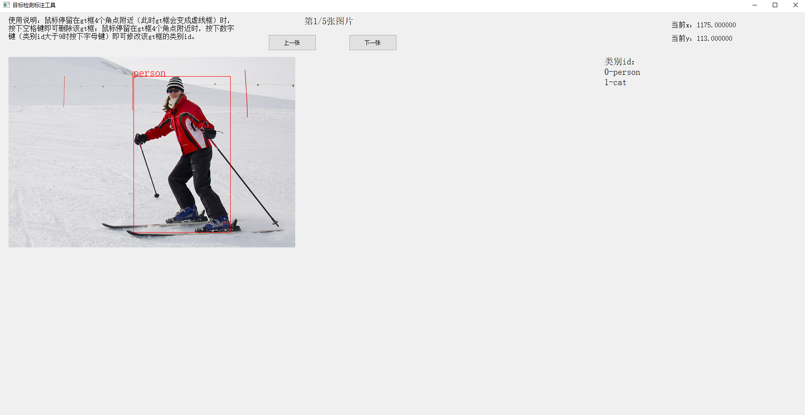

# miemieLabels

## 概述

miemieLabels是女装大佬[咩酱](https://github.com/miemie2013) 自用的目标检测标注工具，现在开源给大家使用！支持将txt标注格式导出为COCO标注格式，可以给咩酱自研检测库[miemiedetection](https://github.com/miemie2013/miemiedetection) 或者其它大部分检测库使用。本仓库有2个功能:（1）标注自己的数据集并转成COCO标注格式。（2）txt标注格式转成COCO标注格式。


## 安装依赖

```
pip install -r requirements.txt -i https://pypi.tuna.tsinghua.edu.cn/simple
```

Windows可用，PyQt5提供界面支持。

## 标注自己的数据集并转成COCO标注格式

举一个例子说明如何用miemieLabels标注自己的数据集。假设现在我收集了一个数据集，里面有5张图片（举例说明而已，实际上需要收集更多的图片才能做成一个好的目标检测数据集），放在mydataset文件夹里。假设我想检测的类别只有人、猫这两个类别而已。


### 第一步，标注图片

打开biaozhu.py，在initUI(self)方法里，修改self.images_dir、self.annos_dir、self.classes为自己数据集的配置。self.images_dir表示的是待标注图片的目录，比如这个例子是'mydataset/'；self.annos_dir表示的是生成的txt注解文件保存的目录，比如这个例子设置为'mydataset_txt/'；self.classes表示的是数据集的类别名，比如这个例子是'person'、'cat'，按照append的先后顺序，'person'的类别id是0，'cat'的类别id是1。

```
        # 待标注图片的目录
        self.images_dir = 'mydataset/'
        # 生成的注解文件保存的目录
        self.annos_dir = 'mydataset_txt/'
        self.classes = []
        self.classes.append('person')
        self.classes.append('cat')
```

修改完这3个变量之后，运行biaozhu.py，显示界面如下图（ui.png）所示：





可以看到第一张图片只有一个人，鼠标对准人的gt框左上角，按住鼠标左键，拖动到人的gt框右下角，松开鼠标左键，就标注好一个gt框了！但是还没有确定类别id，修改gt框的类别id很简单，鼠标停留在gt框4个角点附近（此时gt框会变成虚线框）时，按下数字键（类别id大于9时按下字母键）即可修改该gt框的类别id。类别id键（类别id大于9时变成字母键，受限于这个机制目前只支持最多36个类别的数据集标注）和类别名的对应关系在界面右边有提示。删除一个gt框也很简单，鼠标停留在gt框4个角点附近（此时gt框会变成虚线框）时，按下空格键即可删除该gt框。标注完第一张图片后，点击“下一张”按钮，进入下一张图片的标注。标注完所有图片后，进入'mydataset_txt/'文件夹，发现保存了5个txt注解文件，打开txt文件查看，发现每个文件都只有一行内容，如下所示：


```
# 000000000785.txt
000000000785.jpg 279,43,495,391,0

# 000000033759.txt
000000033759.jpg 73,60,272,456,0

# 000000039769.txt
000000039769.jpg 4,54,315,474,1 345,25,639,371,1

# 000000050811.txt
000000050811.jpg 74,66,467,493,0

# 000000051008.txt
000000051008.jpg 3,129,403,478,1
```

第一张图片的txt注解文件的内容，“000000000785.jpg”表示的是图片名，注意，仅仅是文件名而不是文件的路径！后面的“ 279,43,495,391,0”表示的是一个gt框，5个数表示1个gt框，分别为“物体左上角x坐标,物体左上角y坐标,物体右下角x坐标,物体右下角y坐标,物体类别id”，假如有多个gt框，那么它们会用空格隔开，比如000000039769.jpg这张照片，刚才你标注了两只猫。


### 第二步，合并txt注解文件

接下来，把所有txt注解文件合并成1个txt文件。编辑biaozhu_daochu.py，修改annos_dir为刚才保存的txt注解文件的目录，这个示例为'mydataset_txt/'；save_name表示的是合并的txt注解文件的名字，这里默认为'annos.txt'。运行biaozhu_daochu.py，就会在项目根目录看到'annos.txt'，打开它，发现有5行内容，即合并后的所有图片的注解，一行表示一张图片的注解。


### 第三步，划分训练集和验证集

接下来，划分训练集和验证集。项目根目录下新建两个空的txt文件annos_train.txt、annos_val.txt。根据自己的需求，把训练集图片的注解加到annos_train.txt里，把验证集图片的注解加到annos_val.txt里。这个例子里咩酱把annos.txt里前3行加到annos_train.txt里，后2行加到annos_val.txt里。即前3张图片作为训练集，后2张图片作为验证集。


### 第四步，转换txt注解文件为COCO标注格式的json注解文件

然后，转换txt注解文件为COCO标注格式的json注解文件。打开1_txt2json.py，修改这7个变量：

```
    # 自定义数据集的注解转换成coco的注解格式。只需改下面7个即可。文件夹下的子目录（子文件）用/隔开，而不能用\或\\。
    train_path = 'annos_train.txt'
    val_path = 'annos_val.txt'
    test_path = None   # 如果没有测试集，填None；如果有测试集，填txt注解文件的路径。
    classes_path = 'class_names/my_classes.txt'
    train_pre_path = 'mydataset/'   # 训练集图片相对路径
    val_pre_path = 'mydataset/'     # 验证集图片相对路径
    test_pre_path = 'mydataset/'    # 测试集图片相对路径
```

这个例子咩酱已经帮大家修改好了。train_path表示的是训练集的txt注解文件路径。val_path表示的是验证集的txt注解文件路径。test_path表示的是测试集的txt注解文件路径，如果没有划分出测试集，填None。classes_path表示的是数据集的类别名txt文件路径（自定义数据集，需要新建该文件并编辑类别名保存。这里咩酱已经帮大家新建并编辑好了。），一行表示一个类别名，从上到下依次是类别id为0、1、2、...的类别名，顺序千万不要填错！train_pre_path表示的是训练集图片相对路径。val_pre_path表示的是验证集图片相对路径。test_pre_path表示的是测试集图片相对路径，如果没有划分出测试集，不用关心它的值是什么。


修改好这7个变量后，运行1_txt2json.py就会在annotation_json目录下生成两个coco注解风格的json注解文件annos_train.json、annos_val.json。


### 第五步，模仿COCO数据集整理自定义数据集的文件夹结构

最后一步，模仿COCO数据集整理自定义数据集的文件夹结构。比如这个示例，整理成这样：

```
D://GitHub
     |------COCO
     |        |------annotations
     |        |------test2017
     |        |------train2017
     |        |------val2017
     |
     |------mydataset
     |        |------annotations
     |        |         |----------annos_train.json
     |        |         |----------annos_val.json
     |        |------images
     |                  |----------000000000785.jpg
     |                  |----------000000033759.jpg
     |                  |----------000000039769.jpg
     |                  |----------000000050811.jpg
     |                  |----------000000051008.jpg
     |
     |------miemiedetection-master
              |------assets
              |------class_names
              |------mmdet
              |------tools
              |------...
```

整理成mydataset文件夹这样。但是和COCO有点不同，COCO的训练集、验证集、测试集的图片分别用train2017、val2017、test2017文件夹装，而我们的所有图片只用一个文件夹images装，不过没有影响，都能正常训练验证。这样就做好一个COCO注解格式的数据集了！！！


如果你想要用[miemiedetection](https://github.com/miemie2013/miemiedetection) 里的预训练模型fine-tune这个数据集，mmdet.exp.datasets.coco_base.COCOBaseExp类里的配置项修改成这样：
```
        self.num_classes = 2
        self.data_dir = '../mydataset'
        self.cls_names = 'class_names/my_classes.txt'  # 上文的my_classes.txt。需要自己在miemiedetection里新建并编辑好这个文件。
        self.ann_folder = "annotations"
        self.train_ann = "annos_train.json"
        self.val_ann = "annos_val.json"
        self.train_image_folder = "images"
        self.val_image_folder = "images"
```


## 其他标注格式的数据集转换成COCO标注格式
读者自己写一个脚本，把其他标注格式的注解文件转换成上文annos.txt（或者annos_train.txt、annos_val.txt。）格式，一行表示一张图片的注解，注意，一行的开头表示的仅仅是图片名而不是图片的路径！再接着第三步（或者第四步）往下走就行。本仓库给了一个示例1_voc2txt.py将VOC标注格式转换成txt标注格式。


## 传送门
cv算法交流q群：645796480
但是关于仓库的疑问尽量在Issues上提，避免重复解答。

B站不定时女装: [_糖蜜](https://space.bilibili.com/646843384)

本人微信公众号：miemie_2013

技术博客：https://blog.csdn.net/qq_27311165

AIStudio主页：[asasasaaawws](https://aistudio.baidu.com/aistudio/personalcenter/thirdview/165135)

欢迎在GitHub或AIStudio上关注我（求粉）~
